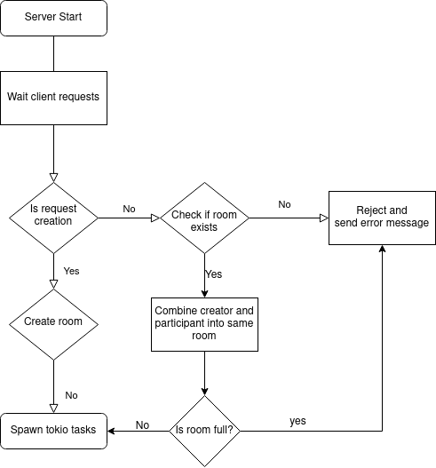

### Simple game server for demonstration

Card client : [Client](https://github.com/simhyeon/cardclient)

### Crates used

- Warp  : Websocket
- Tokio : Async execution
- Scrum : Easy enum type manipulation
- serde : Easy rust struct convertion into json format
- uuid  : Making a unique identifier for game rooms

### How it works

Server only exposes two routes to clients. One is create and other is join. When a client access create route, server creates a room with unique identifier so that other player can join the room with id.

If another player enter the room id within a input field of client then the player can join the room.

Each players can play certain actions, namely bets which is then submitted to server. Server listens to such requests and perform necessary operations to check if given bet is valid and send server response back to the client so that client can proceed to other state.

Game consists of sequential states of Flop, Turn, River and Showdown. Server listenes to player requests and move next state only if both players have played their bet. If players did not play bets then server assumes the player has played 'check'.

After river state, server calculates both players' card combination and send round result as server response. If win condition is met then game is over and both client is disconnected.

##### Flow Chart

### Technical details

#### Websocket

Websocket is fully configured by warp crate and server utiltizes warp's ability to updgrade http request to websocket protocol. After that websocket is splitted into sink and stream so that server can forward different stream back to client.

#### Room data manipulation

Room information is simply put inside of memory for simplicity. Room is structured as Arc<RwLock<...>> so that multiple tokio tasks can access the room information at the same time while prohibiting simultaneous write operations to prevent race condition.

#### Internal stream

Other than websocket stream and server forward stream, one more stream is constructed when room is created for internal request and responses. Internal request is to free the room data and let room data can be accessed by other task.

#### Timeout based state management, or stateful web server

On every state change, server starts timeout which is executed on higher level of tokio task so that task doesn't hold the game's information for timeout period.

Timeout request is sent with state id to prevent timeout method from executing after state changes.

